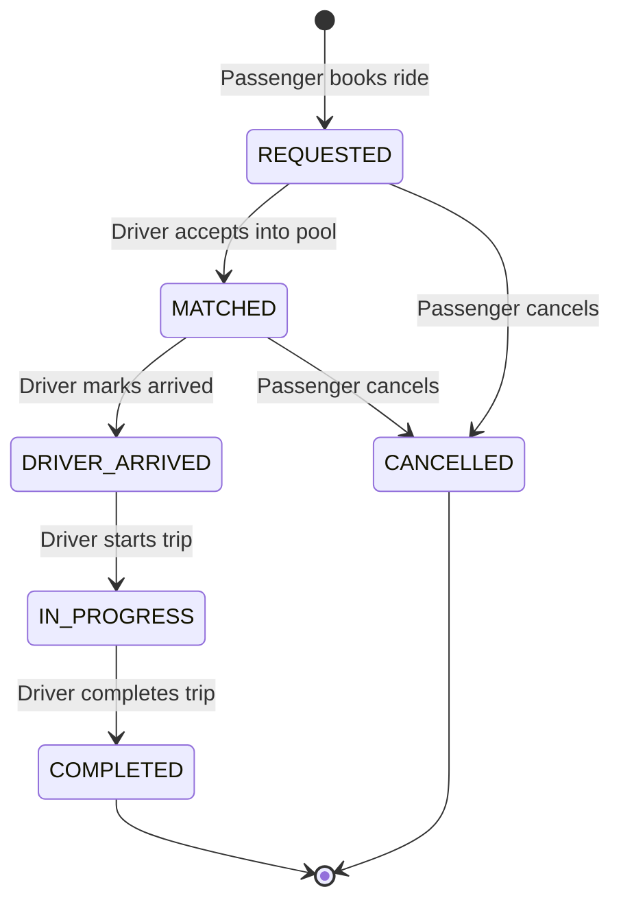
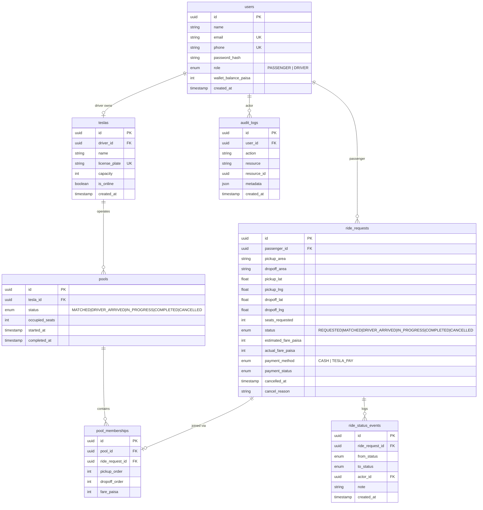
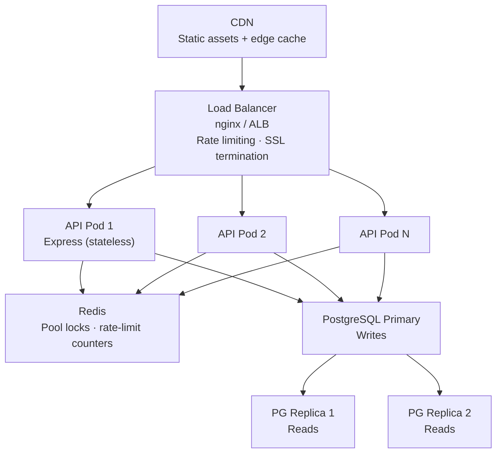

# ⚡ Dhaka Tesla Pool

> **Share a seat. Split the fare. Survive Dhaka traffic.**

A ride-pooling MVP for Dhaka — connecting passengers heading the same way, splitting fares fairly, and keeping Jashim's Bullet (a 3-seat battery-powered Tesla) moving efficiently through rush-hour traffic.

---

## 📋 Table of Contents

- [The Story](#-the-story)
- [Features](#-features-implemented)
- [Architecture](#️-architecture)
- [Database ERD](#-database-erd)
- [Fare Model](#-fare-model)
- [Pool Matching](#-pool-matching-rule)
- [Tech Stack](#-tech-stack--justification)
- [Project Structure](#-project-structure)
- [Quick Start](#-quick-start)
- [Docker Setup](#-docker-setup)
- [API Overview](#-api-overview)
- [Testing](#-testing)
- [Concurrency](#-concurrency-design)
- [Key Decisions & Trade-offs](#-key-decisions--trade-offs)
- [If Oi Tesla Goes Viral](#-if-oi-tesla-goes-viral--scale-to-1m)
- [AI Usage](#-ai-usage)
- [Known Limitations](#-known-limitations)

---

## 🎭 The Story

8:41 AM, Banani Road 11. **Jashim** is leaning against **Bullet**, his three-seat, battery-powered, entirely unaffiliated "Tesla." **Nusrat**, already late, books a ride to Mohakhali. Two minutes later a stranger named **Rafiq** books almost the same route to Gulshan 1. The app figures out — in about a second — whether these two can share a seat, split the fare fairly, and survive a ten-minute ride. Then **Shirin** tries to grab the last seat thirty seconds later, and things get *properly interesting*.

### Demo Credentials

| Role | Name | Email | Password |
|------|------|-------|----------|
| Driver | Jashim Uddin | jashim@teslapool.dhaka | Bullet@2024 |
| Passenger | Nusrat Jahan | nusrat@teslapool.dhaka | Nusrat@2024 |
| Passenger | Rafiq Islam | rafiq@teslapool.dhaka | Rafiq@2024 |
| Passenger | Shirin Akter | shirin@teslapool.dhaka | Shirin@2024 |

---

## ✅ Features Implemented

### Passenger
- [x] Sign up / Sign in (JWT auth, role-based)
- [x] Request a ride: pickup area, dropoff area, seats (1–3), payment method
- [x] **Solo vs Pool toggle** — explicit choice with live fare diff shown
- [x] See estimated fare (solo + pooled preview with 20% discount)
- [x] Track status: REQUESTED → MATCHED → DRIVER_ARRIVED → IN_PROGRESS → COMPLETED
- [x] **Live driver map** — Leaflet/OpenStreetMap with animated driver marker
- [x] View ride history with status timeline
- [x] Cancel while in REQUESTED or MATCHED status only
- [x] Ownership enforcement: cannot view/cancel another passenger's ride

### Driver / Tesla
- [x] Sign in, toggle Bullet online/offline
- [x] See pending ride requests (only when online)
- [x] Select one or multiple compatible rides to pool
- [x] Accept rides into a pool (capacity enforced atomically)
- [x] Mark arrival, start trip, complete trip (lifecycle transitions)
- [x] View all passengers + individual fares in each pool
- [x] Full ride history

### Pool / Ride Split
- [x] Multiple passengers can share one Tesla (up to capacity)
- [x] Pool-compatible route matching (zone-based, documented)
- [x] Individual fares per passenger (different routes = different fares)
- [x] Pool discount (20%) applied automatically when sharing
- [x] Clear lifecycle with invalid transitions rejected
- [x] Atomic capacity enforcement (prevents overbooking)
- [x] Immutable audit trail (RideStatusEvent log)

### UX / i18n
- [x] 5 languages: English, বাংলা, हिन्दी, العربية (RTL), اردو (RTL)
- [x] Dark glassmorphism UI with animated ambient orbs
- [x] Language persisted via localStorage, RTL applied to `document.documentElement`

---

## 🏗️ Architecture

### System Diagram

```mermaid
flowchart LR
    Browser[Browser / Next.js 14]

    subgraph FE [Frontend localhost:3000]
        HP[Homepage]
        PD[Passenger Dashboard]
        DD[Driver Dashboard]
        Map[RideMap - Leaflet OSM]
    end

    subgraph BE [Backend localhost:4000 - Express]
        MW[JWT + Zod Middleware]
        Auth[/api/auth]
        Rides[/api/rides]
        Driver[/api/driver]
        Areas[/api/areas]
    end

    subgraph Logic [Business Logic]
        Fare[Fare Engine]
        Pool[Pool Matcher]
        Zones[Area Registry - 9 zones]
    end

    DB[(PostgreSQL 16)]

    Browser --> FE
    FE -->|fetch + JWT| MW
    MW --> Auth & Rides & Driver & Areas
    Rides --> Fare & Pool
    Driver --> Pool
    Areas --> Zones
    Fare --> Zones
    Auth & Rides & Driver & Areas --> DB
    PD --> Map
```

### Request Lifecycle



---

## 🗃️ Database ERD



---

## 💰 Fare Model

> Fully hand-testable. The evaluator can verify Nusrat and Rafiq's fares with a calculator.

```
passengerFare = (baseFare + distanceCharge) × (1 − poolDiscount)

where:
  baseFare       = 2000 paisa  (20 BDT)
  distanceCharge = round(distanceKm × 500)  (5 BDT/km)
  poolDiscount   = 20%  (when 2+ passengers share)
                 = 0%   (solo ride)
```

### Hand-verification: Nusrat + Rafiq's pooled trip

| Step | Nusrat (Banani→Mohakhali) | Rafiq (Banani→Gulshan) |
|------|--------------------------|------------------------|
| Distance | ~2.2 km | ~2.0 km |
| Base fare | 2000 paisa | 2000 paisa |
| Distance charge | `round(2.2 × 500)` = 1100 paisa | `round(2.0 × 500)` = 1000 paisa |
| Gross fare | 3100 paisa | 3000 paisa |
| Pool discount (20%) | −620 paisa | −600 paisa |
| **Final fare** | **2480 paisa (৳24.80)** | **2400 paisa (৳24.00)** |

### Money storage: Why integer paisa?

Stored as `INTEGER` paisa (1 BDT = 100 paisa). This avoids floating-point rounding errors in money arithmetic. `0.1 + 0.2` in IEEE 754 doesn't equal `0.3`; working in integer paisa avoids this class of bug entirely. The same approach is used by Stripe (stores in the smallest currency unit).

---

## 🗺️ Pool Matching Rule

No live map API. Areas are predefined centroids with zone assignments:

| Zone A | Zone B | Zone C |
|--------|--------|--------|
| Banani | Dhanmondi | Mirpur |
| Gulshan | Farmgate | Uttara |
| Mohakhali | Motijheel | |
| Bashundhara | | |

**Pool-compatibility rule:**
1. Pickup areas must be in the **same zone** (Zone A, B, or C)
2. Dropoff areas must be in the **same or adjacent zone** (within 1 zone boundary)

**Applied to Nusrat + Rafiq:**
- Nusrat: Banani (Zone A) → Mohakhali (Zone A)
- Rafiq: Banani (Zone A) → Gulshan (Zone A)
- Both pickups: Zone A ✅ · Both dropoffs: Zone A ✅ → **Compatible**

**Shirin's edge case:** If Shirin requests Banani → Mohakhali, she's compatible BUT Bullet only has 3 seats. If Nusrat (1 seat) + Rafiq (1 seat) are already matched = 2 occupied, Shirin gets 1 remaining seat. If two passengers race simultaneously (last seat), the atomic DB transaction prevents a double-booking.

---

## 🛠️ Tech Stack & Justification

| Layer | Choice | Alternatives considered | Why this? | Switch when? |
|-------|--------|------------------------|-----------|--------------|
| Frontend | Next.js 14 (App Router) | Plain React + Router | SSR/routing built-in, good DX, recommended in brief | If team strongly prefers SPA-only |
| Backend | Express.js | NestJS, Fastify | Minimal, well-understood, easy to justify every line. NestJS is great but its abstraction layers add cognitive overhead for an MVP | Switching to NestJS at 5+ engineers for structure/IoC |
| Database | PostgreSQL 16 | SQLite, MySQL | Relational integrity for pooling/capacity, transactions for race conditions, JSONB for metadata | SQLite would work for pure local demo but fails under concurrent load |
| ORM | Prisma | TypeORM, Drizzle, raw SQL | Type-safe schema, migrations, excellent DX, generates types from schema | Drizzle for ultra-performance-critical SQL |
| Auth | JWT (jsonwebtoken) | Passport.js, Auth0, sessions | Stateless, simple for MVP, role included in token. No session storage needed | Auth0 or Supabase Auth if SSO/OAuth required |
| Validation | Zod | Joi, Yup | TypeScript-native, schema doubles as type inference, excellent error messages | — |
| CSS | Vanilla CSS (custom design system) | Tailwind, Styled Components | Full control, no build-time processing, glassmorphism design | Tailwind if team prefers utility-first |
| Map | Leaflet + OpenStreetMap | Google Maps, Mapbox | Free, no API key, sufficient for zone-level display | Google Maps if turn-by-turn routing needed |
| Testing | Jest + Supertest | Vitest, Mocha | Jest is the standard Node.js test framework, Supertest for HTTP integration tests | Vitest for ESM-native projects |
| Docker | docker compose | K8s, plain Docker | Docker Compose is sufficient for a single-machine MVP | — |

---

## 📁 Project Structure

```
dhaka-tesla-pool/
├── backend/
│   ├── prisma/
│   │   ├── schema.prisma        # Database schema (7 models)
│   │   └── seed.ts              # Jashim, Bullet, Nusrat, Rafiq, Shirin
│   ├── src/
│   │   ├── controllers/
│   │   │   ├── auth.controller.ts
│   │   │   ├── ride.controller.ts
│   │   │   └── driver.controller.ts
│   │   ├── middleware/
│   │   │   ├── auth.ts          # JWT verification + role guard
│   │   │   ├── validate.ts      # Zod middleware factory
│   │   │   └── errorHandler.ts  # ZodError + ApiError handler
│   │   ├── routes/
│   │   │   ├── auth.routes.ts
│   │   │   ├── ride.routes.ts
│   │   │   ├── driver.routes.ts
│   │   │   └── areas.routes.ts
│   │   ├── utils/
│   │   │   ├── areas.ts         # 9 Dhaka area centroids + zone matching
│   │   │   ├── fare.ts          # Fare calculation engine
│   │   │   ├── prisma.ts        # Singleton DB client
│   │   │   └── response.ts      # API response helpers
│   │   ├── app.ts               # Express app setup + CORS
│   │   └── index.ts             # Server entrypoint
│   ├── tests/
│   │   ├── api.test.ts          # Integration tests (auth, ownership, capacity)
│   │   ├── fare.test.ts         # Fare unit tests (hand-verifiable)
│   │   ├── pool.test.ts         # Pool matching unit tests
│   │   ├── setup.ts
│   │   └── teardown.ts
│   ├── Dockerfile               # Multi-stage Node 20 Alpine build
│   ├── entrypoint.sh            # migrate → seed → start
│   └── package.json
├── frontend/
│   ├── app/
│   │   ├── layout.tsx           # Root layout: AuthProvider + LangProvider
│   │   ├── globals.css          # Premium design system v2 (glassmorphism)
│   │   ├── page.tsx             # Landing page with hero, stats, how-it-works
│   │   ├── login/page.tsx       # Login with i18n + role-based redirect
│   │   ├── register/page.tsx    # Register with role selector + i18n
│   │   ├── passenger/page.tsx   # Dashboard: request, track, cancel, map
│   │   └── driver/page.tsx      # Dashboard: online, accept, lifecycle
│   ├── components/
│   │   ├── LangSwitcher.tsx     # Language dropdown (5 languages)
│   │   └── RideMap.tsx          # Live Leaflet map with animated driver
│   ├── lib/
│   │   ├── api.ts               # Typed fetch client for all endpoints
│   │   ├── auth-context.tsx     # React auth context (JWT persistence)
│   │   ├── i18n.ts              # Translation dictionary (EN/BN/HI/AR/UR)
│   │   └── lang-context.tsx     # Language context + RTL management
│   ├── Dockerfile               # Next.js standalone output
│   └── package.json
├── docker-compose.yml           # db + api + frontend; health checks
├── .env.example                 # All env vars with defaults
└── README.md
```

---

## 🚀 Quick Start

### Prerequisites
- Node.js 20+
- PostgreSQL 16 (or Docker)
- npm 10+

### 1. Clone & configure environment

```bash
git clone <your-repo>
cd dhaka-tesla-pool
cp .env.example .env
# Edit .env if needed (defaults work for local dev)
```

### 2. Start the backend

```bash
cd backend
npm install
npx prisma generate
npx prisma migrate dev --name init
npx ts-node prisma/seed.ts
npm run dev
# API available at http://localhost:4000
```

### 3. Start the frontend

```bash
cd frontend
npm install
# Ensure NEXT_PUBLIC_API_URL=http://localhost:4000/api in .env.local
npm run dev
# App available at http://localhost:3000
```

---

## 🐳 Docker Setup

```bash
# Copy environment file
cp .env.example .env

# Build and start all services (db + api + frontend)
docker compose up --build

# Services:
#   PostgreSQL: localhost:5432
#   API:        http://localhost:4000
#   Frontend:   http://localhost:3000

# Health check:
curl http://localhost:4000/health

# Seed data is automatically applied on first startup via entrypoint.sh
# (migrate → seed → start server)
```

### Environment Variables

| Variable | Default | Description |
|----------|---------|-------------|
| `POSTGRES_USER` | teslapool | DB username |
| `POSTGRES_PASSWORD` | teslapool_secret | DB password |
| `POSTGRES_DB` | teslapool_db | DB name |
| `DATABASE_URL` | postgresql://... | Full connection string |
| `JWT_SECRET` | *(required)* | Sign/verify JWT tokens — change in production |
| `JWT_EXPIRES_IN` | 7d | Token lifetime |
| `PORT` | 4000 | API port |
| `NEXT_PUBLIC_API_URL` | http://localhost:4000/api | API URL from browser |
| `FRONTEND_URL` | http://localhost:3000 | CORS origin |

---

## 📡 API Overview

All endpoints return `{ success: boolean, data?: T, error?: string }`.

### Auth

| Method | Path | Auth | Description |
|--------|------|------|-------------|
| POST | `/api/auth/register` | — | Register passenger or driver |
| POST | `/api/auth/login` | — | Login, get JWT token |
| GET | `/api/auth/me` | ✅ | Get current user profile |

### Rides (Passenger)

| Method | Path | Description |
|--------|------|-------------|
| POST | `/api/rides/request` | Request a new ride (seats, pickup, dropoff, payment) |
| GET | `/api/rides` | List my rides (with status events + pool info) |
| GET | `/api/rides/:id` | Get a single ride (owned only) |
| POST | `/api/rides/:id/cancel` | Cancel a ride (REQUESTED/MATCHED only) |

### Driver

| Method | Path | Description |
|--------|------|-------------|
| PATCH | `/api/driver/tesla/status` | Toggle Bullet online/offline |
| GET | `/api/driver/requests` | See pending ride requests (online only) |
| POST | `/api/driver/pools/accept` | Accept 1–N rides into a pool |
| GET | `/api/driver/pools` | List all pools |
| GET | `/api/driver/pools/:poolId` | Get pool details with passengers |
| PATCH | `/api/driver/pools/:poolId/status` | Advance: MATCHED→DRIVER_ARRIVED→IN_PROGRESS→COMPLETED |

### Areas

| Method | Path | Description |
|--------|------|-------------|
| GET | `/api/areas` | List all 9 Dhaka areas with lat/lng |
| GET | `/api/areas/fare-estimate?pickup=Banani&dropoff=Mohakhali` | Get solo + pooled fare estimate |

---

## 🧪 Testing

```bash
cd backend

# Run all tests
npm test

# With coverage
npm run test:coverage
```

Tests cover (without coverage-chasing — only risky behavior):

| Test | What's verified |
|------|----------------|
| `fare.test.ts` | Nusrat + Rafiq's exact fares (hand-verifiable), pool discount math, paisa conversion |
| `pool.test.ts` | Zone-based route compatibility, Banani story scenario |
| `api.test.ts` | Auth flow, ride ownership enforcement, capacity enforcement (4 rides > 3 seats = 409), invalid state transitions rejected, cancellation rules, cross-passenger isolation |

---

## ⚡ Concurrency Design

### The Problem

Bullet has 1 seat left. Nusrat and Shirin both try to claim it at nearly the same instant.

### Current Solution (MVP)

All pool creation happens inside a Prisma `$transaction`. The `UPDATE pool SET occupied_seats = X WHERE id = Y` atomically validates and updates the seat count. If two requests arrive simultaneously, PostgreSQL's row-level locking ensures only one wins — the second gets a consistent read of the updated seat count and will fail the capacity check.

```typescript
// In driver.controller.ts – acceptRides()
await prisma.$transaction(async (tx) => {
  // CREATE pool (atomic)
  // CREATE memberships (atomic)
  // UPDATE ride statuses (atomic)
});
```

### At Scale

At 1M passengers / 100k drivers, this transaction approach creates lock contention. The production solution would be:

1. **Optimistic locking**: Add a `version` field to `Pool`. Update only if `version = expected_version`. Retry on conflict.
2. **SELECT FOR UPDATE**: `SELECT * FROM pools WHERE id = ? FOR UPDATE` to hold a row lock until commit.
3. **Queue-based matching**: Move pool matching into a work queue (e.g., Bull/Redis). Each pool has a single consumer, eliminating concurrent writes.
4. **Redis distributed lock**: `SET pool:{id}:lock NX EX 5` to serialize requests per pool across multiple API instances.

---

## 📈 If Oi Tesla Goes Viral – Scale to 1M



**Key scaling decisions:**
- **Stateless API**: JWT means any pod handles any request — horizontal scaling is trivial
- **Read replicas**: Ride history reads go to replicas; writes stay on primary
- **Geospatial index**: `CREATE INDEX ON ride_requests USING GIST (ST_Point(pickup_lng, pickup_lat))` for area-based queries at scale
- **Pool matching queue**: Matching goes into a Bull queue — one worker per pool, no lock contention
- **WebSocket / SSE**: Replace 5-second polling with server-sent events for real-time status updates
- **Idempotency**: Ride request endpoint accepts idempotency keys (`X-Idempotency-Key`) to safely retry failed requests
- **Rate limiting**: Per-user rate limits on `/api/rides/request` (prevents fare abuse)
- **Observability**: Structured JSON logs + OpenTelemetry traces + Prometheus metrics
- **DB indexing**: Indexes on `(pickup_area, status)`, `(passenger_id, status)`, `(tesla_id, status)` already in schema
- **Soft deletes**: Never hard-delete ride history — regulatory/dispute requirement
- **Multi-region**: Deploy to Singapore (closer to BD) with Neon/Supabase global DB

---

## 🤖 AI Usage

Per the brief — AI use is disclosed, not hidden.

**Tools used:** Google Antigravity IDE (powered by Gemini) for pair programming, architecture review, and code generation.

**What AI helped with:**
- Boilerplate scaffolding (Prisma schema, Express middleware patterns)
- TypeScript type definitions for the API client
- CSS design system (glassmorphism + premium UI approach)
- Test structure suggestions
- i18n translation dictionary for 5 languages
- Leaflet map integration for live driver tracking

**One AI suggestion I accepted:**  
Using `$transaction` in Prisma for the pool acceptance flow. I had initially planned to do the capacity check and creation as two separate operations. AI correctly pointed out this creates a TOCTOU (time-of-check to time-of-use) race condition and suggested wrapping in a transaction. This directly maps to the concurrency problem in Section 12 of the brief.

**One AI suggestion I rejected/modified:**  
AI initially suggested using Redis for session storage alongside JWT. I rejected this because: (1) JWT is already stateless and sufficient for this MVP, (2) adding Redis purely for session management adds operational complexity without benefit at MVP scale, and (3) the brief explicitly cautions against adding technologies just to look advanced. Redis would only make sense for the distributed lock pattern at 100k+ concurrent users.

---

## ⚠️ Known Limitations

1. **No real-time updates**: Passengers poll every 5 seconds. Production would use WebSockets or SSE.
2. **No payment gateway**: TeslaPay is simulated wallet balance; no real money movement.
3. **Simplified map**: Live driver map uses simulated movement (animate toward pickup/dropoff). Real routing needs Google Maps / OSRM. Area pins use real Dhaka lat/lng centroids from OpenStreetMap.
4. **No driver-passenger messaging**: In production, passengers need to communicate pickup details.
5. **No push notifications**: Status changes require polling. Production uses FCM/APNS.
6. **Single driver**: The MVP assumes Jashim is the only driver. Multi-driver matching needs geospatial search.
7. **No rating system**: Passenger/driver ratings are not implemented.
8. **No SMS/OTP verification**: Phone numbers are stored but not verified.

---

## 🎯 Next Improvements

1. WebSocket (Socket.io) for real-time ride status updates
2. Geospatial driver matching (nearest online Tesla to pickup)
3. Real payment integration (bKash/Nagad API)
4. Driver rating + passenger rating system
5. Admin dashboard for monitoring
6. Push notifications (Firebase)
7. SMS OTP verification
8. Surge pricing model

---

*Built for RoBenDevs Engineering Challenge. Jashim's Bullet still has three seats — but the engineering is production-minded.*
